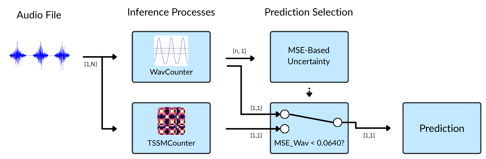
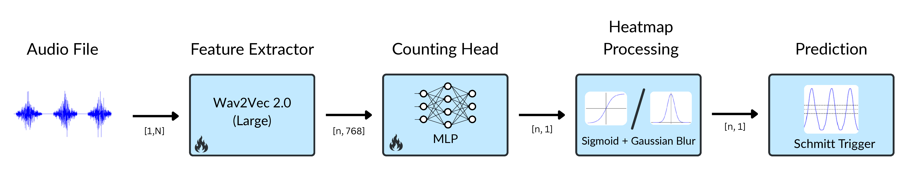
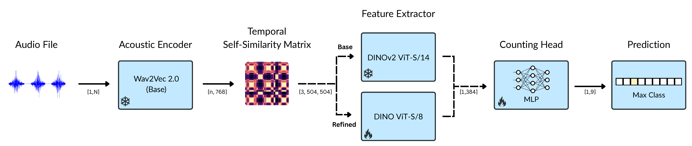

# DualCounter (Class-Agnostic Audio Repetition Counting)

Counting repeated sounds in an audio waveform: a clock striking, hammer blows, a heartbeat, etc. without training on those specific sounds.



**[Paper](#)** &nbsp;·&nbsp; **[Project Page](#)** &nbsp;·&nbsp; **[Demo](#)** &nbsp;·&nbsp; **[Dataset](#)** &nbsp;·&nbsp; **[Pretrained Models](#)**

## Contents

- [Abstract](#abstract)
- [Overview](#overview)
- [Repository Structure](#repository-structure)
- [Setup](#setup)
- [Data Format](#data-format)
- [Usage](#usage)
- [Examples](#examples)
- [Citation](#citation)
- [Acknowledgements](#acknowledgements)

## Abstract

The objective of this paper is class-agnostic audio counting -- counting repeated sounds in an audio waveform, regardless of the class of these audio events. For example counting a clock striking or hammer blows, without training on these classes. To achieve this goal we build on methods that have been used for visual repetition counting in videos, and make the following contributions: (i) We introduce two architectures for class-agnostic audio counting. We compare their performance, and suggest a mechanism for combining their predictions; (ii) we introduce an evaluation dataset with 860 real samples of audio repetitions and ground truth count annotations, covering three distinct domains of sounds -- mechanical, medical and ecological; (iii) we propose a pipeline to generate synthetic training data, and generate 300,000 total samples across several noise conditions. (iv) We show that training the proposed architectures only on synthetic data suffices to obtain very high performance on the real data evaluation dataset, exceeding that of a prior model. All datasets, code, and trained models will be released.

## Overview

This repository implements two class-agnostic counting architectures and a method that selects between their predictions.

**WavCounter** (`WavCounter_trainer.py`, `WavCounter_tester.py`) regresses a repetition heatmap, and derives a count via Schmitt trigger.



**TSSMCounter** (`TSSMCounter_trainer.py`, `TSSMCounter_tester.py`) builds a temporal self-similarity matrix from Wav2Vec2 features and classifies the count directly with a DINO vision transformer.



**DualCounter** (`DualCounter.py`) runs both models and falls back to TSSMCounter when the WavCounter heatmap is low quality.

`SpecCounter.ipynb` contains a baseline spectrogram-based approach, and `preprocessing/` holds shared utilities.

## Repository Structure

```
audio-counting/
├── WavCounter_trainer.py    # train the Wav2Vec2 + MLP heatmap counter
├── WavCounter_tester.py     # evaluate a trained WavCounter checkpoint
├── TSSMCounter_trainer.py   # train the DINO-based TSSM classifier
├── TSSMCounter_tester.py    # evaluate a trained TSSMCounter checkpoint
├── DualCounter.py           # combine WavCounter + TSSMCounter predictions
├── SpecCounter.ipynb        # baseline spectrogram-based approach
├── preprocessing/           # data conversion and generation utilities
├── assets/                  # diagrams and example images used in this README
└── requirements.txt
```

## Setup

```bash
git clone https://github.com/Hamozwa/audio-counting.git
cd audio-counting
python -m venv venv && source venv/bin/activate
pip install -r requirements.txt
```

DINO weights are pulled automatically via `torch.hub` (`facebookresearch/dino`). Pretrained checkpoints for WavCounter and TSSMCounter are available under [Pretrained Models](#), and a live demo is hosted on [Hugging Face Spaces](#).


## Citation

```bibtex
@article{,
  title   = {},
  author  = {},
  journal = {},
  year    = {}
}
```

## Acknowledgements

4th Year Project (4YP), Department of Engineering Science, University of Oxford.
